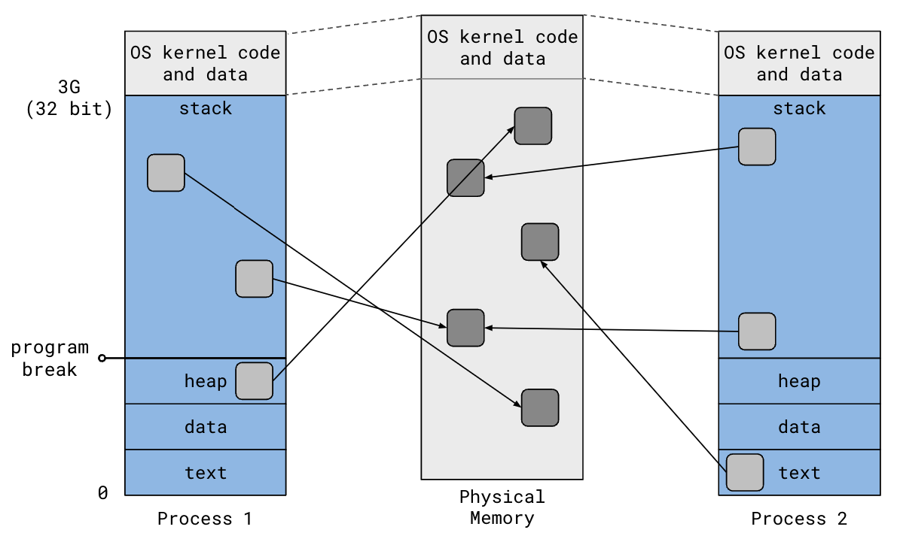
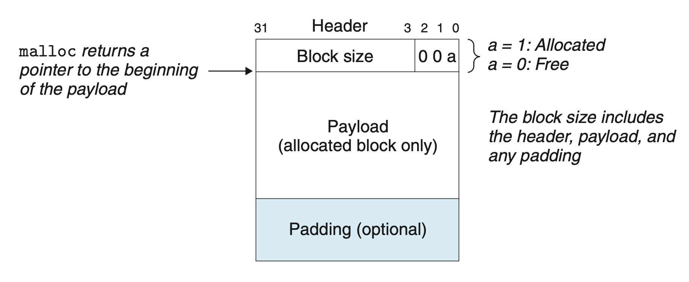
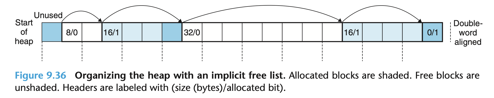
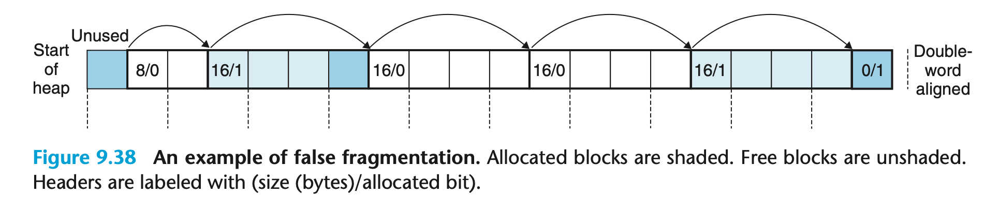
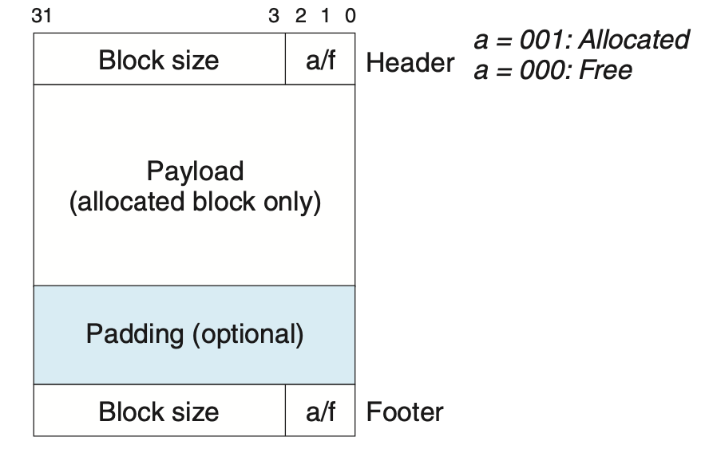
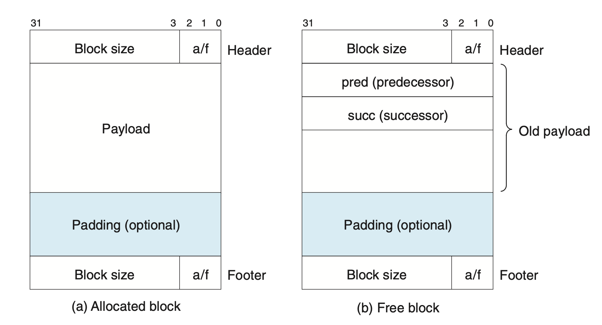

# Introduction to Memory Allocators

> **IMPORTANT!** Note that, the below notes are taken from the references, they are only for educational purposes and will not ever 
> be used for commercial usage, please respect the original content creators. 

## Process Memory Address Space

Recall the 32-bit virtual address space of a process:

- `Text`: program code
- `Data`: static variables
- `Heap`: dynamically allocated memory, grows upward
- `Stack`: automatic memory, grows downward
- OS kernel code & data, shared by all processes

This picture helps you better understand the concepts above:



We use `brk()` system call to change the program break, by increasing the program break to allocate memory and
decreasing the program break to deallocate memory.

The virtual address space is always broken up into chunks called *pages* (typically 4KB size). And the OS kernel
would maintain the mapping from virtual pages to physical pages. 

Difference processes have independent virtual address spaces. They could certainly use `brk()` system call to 
grow and shrink their own heaps, but it is tedious(boring) and difficul to manually manage memory by only using
`brk()` and leading to wasteful memory usage.

That is why most programs use a memory allocator, which provides a simple API to alocate and release blocks on
the heap. In C, the general-purpose memory allocator works as `malloc()` and `free()`.


## `malloc()` and `free()`

In order to ensure efficient memory access, all memory blocks returned by `malloc()` are required to start at an
address that is a multiple of 8 on 32-bit systems or 16 on 64-bit systems. The hardware provides **padding** bytes
for this, which is also an example of *internal fragmentation* (waste when more memory had to be allocated than was
requested).

In contrast, if the memory is spread out into smaller pieces, making the allocator unable to satisfy larger requests,
it is called *external fragmentation*. 

## Implicit Free List

### Block Structure

"Any practical allocator needs some data structure that allows it to distinguish block boundaries and to distinguish
between allocated and free blocks."

Look at this example of a simple heap block structure for 32-bit systems:



It embeds the information in the blocks themselves. Since we impose a double-word (8-byte for 32-bit systems) alignment
constraint, thus the 3 low-order bits of the block size (header) are always zero. Then we could use the least significant
bit to indicate whether the block is allocated or free.

By this way, **an implicit free list** organizes the heap. Its advantage is simplicity, while a significant disadvantage
is that the cost of any operation requires a search of the free list, which is linear in the total number of allocated
and free blocks in the heap.



Note that, there are 4 bytes of padding at the beginning of the heap, ensuring the first block's payload is at an 8-byte
boundary, and there is a special "epilogue" block at the end of the heap with size 0, which the textbook's implementation
uses as a terminator.

A psuedocode example that demonstrates `malloc()` implementation:

```c
char *heap_start = NULL;

// __init_heap() would be called before main() to initialize the heap
void __init_heap() {
    // Get the initial program break and grow heap by arbitrary amount, e.g., 4KB
    heap_start = sbrk(4096);
    // Skip the leading 4-byte padding
    heap_start += 4;

    // Initalize implicit free list, etc.
    // ...
}

void *malloc(size_t size) {
    // Adjust size to include header and satisfy alignment requirements, etc.
    // ...

    // Loop through all heap blocks
    char *block = heap_start;
    while (1) {
        uint32_t header = *(uint32_t *)block;
        // Extract block size and allocated bit from the packed header
        size_t block_size = header & ~0x7;
        int allocated = header & 0x1;

        // This is the epilogue block -- we've reached the end of the heap
        if (block_size == 0)
            return NULL;

        // First fit strategy: return the first block big enough for the
        // request. Next fit and best fit are alternative strategies, but
        // require more work
        if (!allocated && size <= block_size) {
            // Update the block's header to set the allocated bit
            *(uint32_t *)block = block_size | 0x1;

            // Note that we claimed the entire block regardless of how big it
            // actually was. We could have turned the excess bytes into a new
            // free block by initializing a new header after this block.

            // Return a pointer to the payload
            return block + 4;
        }

        // Iterate to the next block
        block += block_size;
    }
}
```


### Coalescing Free Blocks

If a call of `free()` only deallocates the corresponding space, it might cause **false fragmentation**.

Given an example in the following picture, a call to `malloc(20)` would fail even though there is enough space.



One of the solutions is duplicating a block's header at the end of the block. This footer works as a "boundary tag" and helps
us to traverse backwards in the free list.




## From Implicit to Explicit

Actually, we could take advantage of the fact that a free block's payload is unused by repurposing it to store explicit pointers to the prev/next free blocks.




## Reference

- [02-memory-1](https://cs4157.github.io/www/2024-1/lect/02-memory-1.html)
- [CSAPP](../materials/[Book]Computer\ Systems;\ A\ Programmer's\ Perspective\ -\ Randal\ E.\ Bryant\ &\ David\ R.\ O'Hallaron.pdf)
