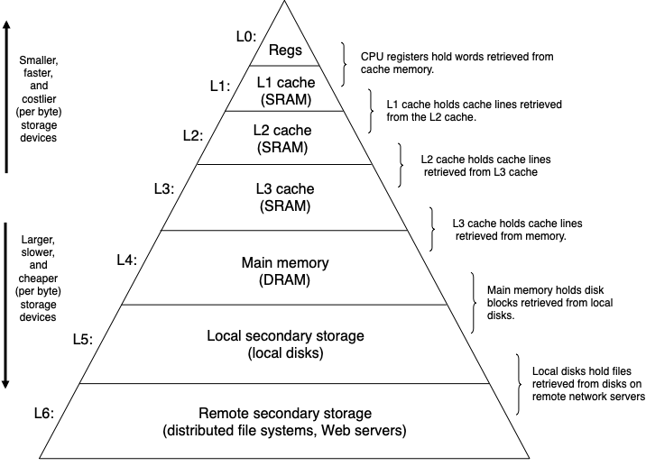

# Caching, Memory Mapping, and Advanced Allocators

> **IMPORTANT!** Note that, the below notes are taken from the references, they are only for educational purposes and will not ever 
> be used for commercial usage, please respect the original content creators. 

## Memory Hierarchy



- **Registers**: small number of fast storage units embedded in CPUs
  - Intel Core i7 has 16 64-bit general purpose registers
  - No added access latency
- **Cache**: small amount of memory between registers and RAM
  - Uses SRAM, which is faster and more expensive than DRAM
  - Several levels of cache to bridge growing disparity between CPU and RAM in speed and capacity
  - Intel Core i7 has 64KB of L1, 256KB of L2, and 8MB of L3
  - Latencies: 4 cycles for L1, 10 cycles for L2, 50 cycles for L3
  - Usually accessed in 64-byte blocks called “cache lines”
- **Main memory**: volatile storage for code and data for running programs
  - Typical laptops have 4GB to 32GB of DRAM
  - Latency: 200 cycles
  - Usually accessed in 4KB chunks called “pages”
- **Local storage**: persistent storage for program and data files 
  - Typical laptops have 256GB to 4TB SSDs
  - Typical desktops have 512GB to 8TB HDDs
  - Latency: 100,000 cycles for SSD, 10,000,000 cycles for HDD

## Cache-conscious Programming

### Principle of Locality
- **Temporal locality**: Once a memory location has been referenced it is likely to be referenced again in the near future

- **Spatial locality**: Once a memory location has been referenced, nearby memory locations are likely to be referenced in the near future

### 2-dimensional Arrays in C

Consider the following 2-dimensional array declaration in C:
```c
int a[3][2];
```
The array is laid out in row-major order in memory as follows:
```
+---------+---------+---------+---------+---------+---------+
| a[0][0] | a[0][1] | a[1][0] | a[1][1] | a[2][0] | a[2][1] |
+---------+---------+---------+---------+---------+---------+
```

So it is easier to understand in some cases, e.g. Summing Matrix Elements & Matrix Multiplication, the order of the loops may have a big influence of memory accessing, cache misses and thus execution speed.

### Summary

- Optimize the inner loops of your program, which tends to dominate computation and memory access
- Strive for *stride-1* reference pattern to maximize *spatial locality* in your program
- Once data has been read from memory, try to use it as much as possible to maximize *temporal locality* in your program


## Memory Mapping using `mmap()`

Instead of performing I/O with `read()/write()`, we can map a region of the file into the address space and treat it like an array of bytes. 

The kernel ensures that updates to this region of memory will get written to the corresponding region on disk. This mapping can be viewed as an example of using main memory as a cache for disk.


Generally speaking, the virtual address space is broken up into pages (typically 4KB) and that the OS kernel maintains a mapping from virtual pages to physical pages in RAM. But for **file-backed mappings**, an additional mapping from physical pages in RAM to regions of disk is added.

The mmap() system call creates new memory mappings:
```c
#include <sys/mman.h>

void *mmap(void *addr, size_t length, int prot, int flag, int fd, off_t offset);
        // Returns: starting address of mapped region if OK, MAP_FAILED on error
```

Here is a brief explanation of the parameters:

- addr: The suggested starting address of the new mapping. Prefer to pass NULL and let mmap() decide the starting address and return it
- length & offset: The length and offset of the mapping
- prot: Protection of the mapped region (e.g., read, write, execute)
- flag: Visibility and other modifiers
  - *MAP_SHARED*: Updates to the mapping are visible to other processes, and are carried through to the underlying file
  - *MAP_PRIVATE*: Updates to the mapping are not visible to other processes, and are not carried through to the underlying file
  - *MAP_ANONYMOUS*: The mapping is not backed by any file. This has the effect of simply allocating memory to the process when used with MAP_PRIVATE
- fd: File descriptor for the file to be mapped. Use -1 for anonymous mapping

## Advanced Allocator Strategies

### Explicit Free List


As we knew, with the explicit free list, searching for a free block only requires iterating through
free blocks in the list, as opposed to all blocks, which was the case was with the implicit free 
list.

But a remaining question is how to update the list when a newly freed block coming.

An obvious strategy is to maintain the free list in **LIFO order**: simply insert the newly freed 
block at the beginning of the list. The following diagram illustrates this:


This approach is simple and fast, and may benefit from **temporal locality**. Reusing a recently freed block means that its memory location may still be in the cache and we don’t have to use a new cache line, possibly evicting other data from the cache.

### Segregated Free Lists

We can further optimize free list search time and memory usage by maintaining multiple free lists. Each free list contains blocks of the same or similar size.

### Real Life Allocators

#### GNU `libc` Implementation
- Reduce contention in multi-threaded environments
  - Shared heap into multiple separate “arenas”
  - Per-thread caching of recently freed blocks
- Handle huge requests off the heap by asking the OS kernel directly using the mmap() syscall, which creates new page mappings for the process
- Deferred coalescing: maintain fast turnaround free lists to keep around recently freed blocks that haven’t been coalesced yet
- Segregated storage: maintain small bins holding fixed-size chunks and large bins holding ranges of chunk sizes
- Periodically shrink the heap when memory blocks at the top of the heap are freed

#### Industry Implementation

`TCmalloc`, from Google, and `jemalloc`, from FreeBSD and currently maintained by Facebook, are some alternatives to GNU libc’s implementation. These allocators are optimized for highly concurrent workloads.

#### Memory Pool Allocator

A program may rely heavily on frequent allocations and deallocation of the same kind of object (e.g., graph algorithm managing fixed-size node objects). Instead of using a general purpose allocator, such programs can use a specialized memory pool allocator for that object.

The pool allocator will allocate a large region of memory (e.g., some multiple of page size), and divide it into equal sized objects. Allocation and deallocation are as simple as marking an object used and freed, respectively. The fixed-size chunks eliminates external fragementation seen in general-purpose allocators due to their support for variable-sized chunks.

## References

- [Understanding the GLIBC Heap Implementation](https://azeria-labs.com/heap-exploitation-part-2-glibc-heap-free-bins/)
- [MallocInternals](https://sourceware.org/glibc/wiki/MallocInternals)
- [03-memory-2](https://cs4157.github.io/www/2024-1/lect/03-memory-2.html)
- [CSAPP](../materials/%5BBook%5DComputer%20Systems%3B%20A%20Programmer's%20Perspective%20-%20Randal%20E.%20Bryant%20%26%20David%20R.%20O'Hallaron.pdf)
